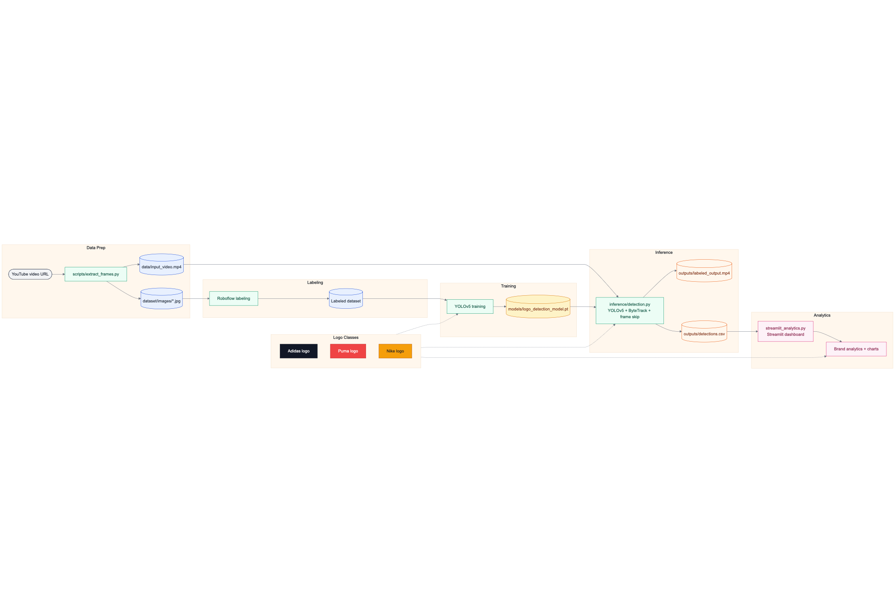

# Brand Logo Detection

This project detects brand logos (Adidas, Puma and Nike) in a video. It draws boxes on each frame, keeps track IDs stable over time, and writes a simple CSV so you can scan when a brand shows up.

## Architecture



## What you get
- `outputs/labeled_output.mp4`: the input video with boxes and labels
- `outputs/detections.csv`: one row per finished track with time, brand, confidence, and box coordinates

## Quick start
1. Install dependencies:
   ```bash
   pip install -r requirements.txt
   ```
2. Put your video at `data/input_video.mp4` (the repo includes a sample).
3. Run inference:
   ```bash
   cd inference
   python detection.py
   ```
   This reads `data/input_video.mp4`, writes `outputs/labeled_output.mp4`, and saves `outputs/detections.csv`.

## Analytics dashboard
The Streamlit app in `streamlit_analytics.py` turns `outputs/detections.csv` into brand exposure charts.
```bash
cd scripts
streamlit run streamlit_analytics.py
```


## How it works
Under the hood it uses a YOLOv5m model to detect logos and ByteTrack to keep detections consistent across frames. It also skips frames to keep processing close to real time.

## Handy scripts
- `scripts/extract_frames.py`: downloads a YouTube video and saves every 30th frame into `dataset/images` for labeling.
  ```bash
  python scripts/extract_frames.py
  ```
  
## Repo layout
- `inference/`: inference script (YOLOv5 + ByteTrack) 
- `models/`: trained weights
- `data/`: input video
- `outputs/`: labeled video + detections CSV
- `dataset/`: extracted frames for labeling
- `training/`: training notes and command used
- `docs/`: decisions, metrics, and architecture notes

## Readme files in subfolders
If you want more detail, these files are meant to be read directly:
- `training/README.md` lists the training setup and command used
- `docs/MODEL_DECISIONS.md` explains why YOLOv5m + ByteTrack was chosen
- `docs/METRICS_AND_OUTPUTS.md` describes the CSV format and how to use it